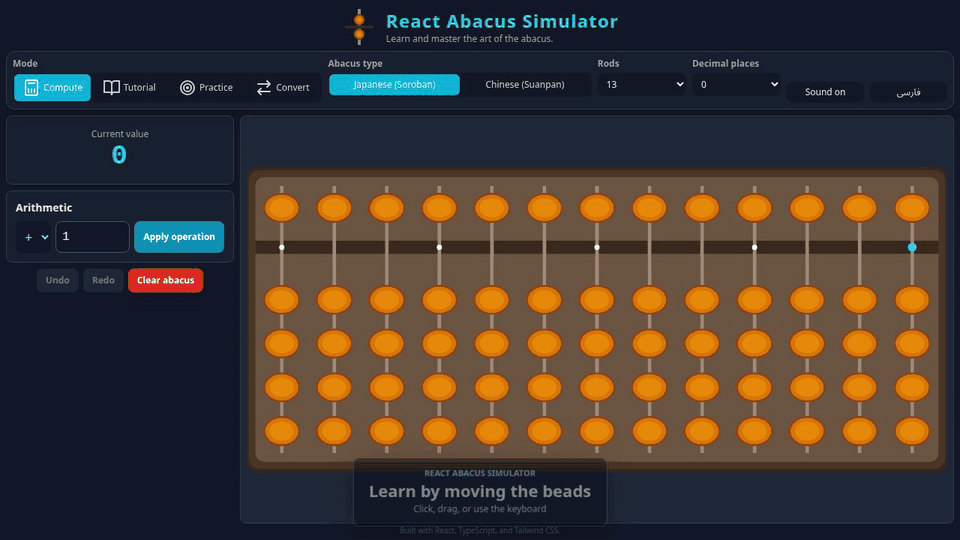

# React Abacus Simulator

<div align="center">
  <a href="./docs/assets/abacus-demo.mp4">
    
  </a>
  <br/>
  <sub>14-second feature tour · Click the preview for the MP4 video</sub>
</div>
<br/>

<div align="center">
  <a href="https://github.com/danial-razi/react-abacus-simulator/blob/main/LICENSE">
    
  </a>
  
  <a href="https://github.com/danial-razi/react-abacus-simulator/stargazers">
    
  </a>
  <a href="https://github.com/danial-razi/react-abacus-simulator/network/members">
    
  </a>
  <a href="https://github.com/danial-razi/react-abacus-simulator/issues">
    
  </a>
</div>
<br/>

A bilingual, accessible abacus learning app with compute, guided tutorial, practice, and conversion modes. Switch between Japanese Soroban and Chinese Suanpan layouts, work with decimals, and install it as an offline PWA.

---

### **[🚀 Live Demo 🚀](https://danial-razi.github.io/react-abacus-simulator)**

---

## ✨ Features

- **Multiple Abacus Types**: Switch between the Japanese (Soroban - 1/4 beads) and Chinese (Suanpan - 2/5 beads) styles.
- **Four Learning Modes**:
  - **Compute**: Move beads freely or apply addition, subtraction, multiplication, and division.
  - **Tutorial**: Complete guided, interactive lessons instead of only watching examples.
  - **Practice**: Solve hidden-answer arithmetic challenges across all four operations, with difficulty levels, streaks, scores, and a saved best score. Hard mode includes 3×3 and 3×4-digit multiplication.
  - **Convert**: Enter an integer or decimal and see its bead representation.
- **Flexible Layout**: Choose 5, 9, or 13 rods and 0–3 decimal places.
- **Accessible Interaction**: Click, drag, or use Tab, arrow keys, Space, and Enter. Undo/redo shortcuts are supported.
- **Bilingual UI**: Switch between English and Persian, including RTL layout.
- **Personal Preferences**: Sound, language, layout settings, lesson progress, and best score persist locally.
- **Responsive Design**: Keeps usable bead targets on mobile with horizontal scrolling.
- **PWA Ready**: Install the app on your device for a native-like experience and offline access.

## 🚀 Quick Start

For the best experience, we highly recommend installing the app as a Progressive Web App (PWA).

1.  Visit the live demo link: **[https://danial-razi.github.io/react-abacus-simulator](https://danial-razi.github.io/react-abacus-simulator)**
2.  Your browser should show an "Install" icon in the address bar. Click it to add the Abacus Simulator to your home screen or desktop.
3.  Launch the app from its icon and use it anytime, even without an internet connection!

## 🛠️ Development

Interested in running the project locally or contributing? Here is how to get started:

1.  **Fork the repository** by clicking the Fork button on the top right of the page.
2.  **Clone your forked repository**:
    ```bash
    git clone https://github.com/danial-razi/react-abacus-simulator.git
    ```
3.  **Navigate to the project directory**:
    ```bash
    cd react-abacus-simulator
    ```
4.  **Install dependencies**:
    ```bash
    npm ci
    ```
5.  **Start the development server**:
    ```bash
    npm run dev
    ```

### Quality checks

Run the complete local quality gate before opening a pull request:

```bash
npm run check
```

This runs TypeScript, ESLint, unit tests, and the production build.

## 🤝 Contributing

Contributions, issues, and feature requests are welcome! Feel free to check the [issues page](https://github.com/danial-razi/react-abacus-simulator/issues).

1.  Fork the Project.
2.  Create your Feature Branch (`git checkout -b feature/AmazingFeature`).
3.  Commit your Changes (`git commit -m 'Add some AmazingFeature'`).
4.  Push to the Branch (`git push origin feature/AmazingFeature`).
5.  Open a Pull Request.

## 📄 License

This project is licensed under the MIT License.
